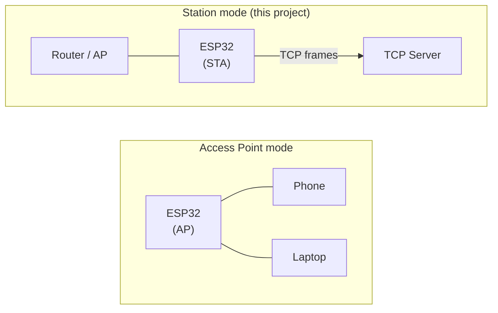

# Project 2 | TCP/IP Telemetry Node for Industrial Machinery

This guide walks through the development of a Wi-Fi telemetry node on an ESP32 microcontroller. The project simulates a machine sending structured sensor data to a remote server over TCP every five seconds. FreeRTOS manages the telemetry task. The firmware is validated on physical hardware using pytest-embedded, and the CI pipeline runs automatically on every push with GitHub Actions.

Every decision here has a reason, and knowing those reasons is what lets you defend it in an interview.

---

## The Project

An ESP32 simulates industrial machinery sensor data (temperature, vibration, state, fault code), serializes each reading into a JSON frame with cJSON, and transmits it over a TCP socket to a Python monitoring server. Wi-Fi association is managed in station mode using FreeRTOS event groups for synchronization. Hardware-in-the-loop tests validate firmware behavior over UART with pytest-embedded. A GitHub Actions CI pipeline builds the firmware and runs target tests automatically on every push.

---

## Milestones

| # | Milestone | What we build |
|---|-----------|---------------|
| 1 | Initial Setup | Boot message over UART, ESP-IDF toolchain, CMake build |
| 2 | Wi-Fi Connection | Station mode, event groups, IP acquisition |
| 3 | Telemetry Protocol | `telemetry_t` struct, cJSON serialization, TCP socket, Python server |
| 4 | Target Tests | pytest-embedded over UART, 5 test cases, no TCP server required |
| 5 | CI Pipeline | GitHub Actions: build job + self-hosted target-test job |

---

## Milestone 1 - Initial Setup: Getting the Board Talking

### Goal

By the end of this milestone the firmware prints a boot message over UART. No Wi-Fi yet, no tasks yet. The goal is a single line of output that confirms the entire setup is working end to end.

### Why start here

On any embedded project, the first thing to establish is a communication channel with the board. Before networking, before an RTOS task, before anything else, we need to confirm three things:

1. The toolchain is installed and producing working code for this target
2. The board boots and executes our code
3. We can observe runtime behavior

ESP-IDF provides `printf` via UART0 out of the box; no peripheral configuration required beyond what the framework already sets up. One `printf` in `app_main` is enough to confirm all three.

> **Interview angle:** "What is the first thing you do on a new embedded project?" The answer is: prove the board boots and establish a channel to observe runtime behavior. That confirms the toolchain, the flash process, and the board are all working before adding any complexity.

### ESP-IDF: what it is and why we use it

ESP-IDF (Espressif IoT Development Framework) is the official SDK for the ESP32 family. It is not just a HAL; it includes FreeRTOS, a TCP/IP stack (lwIP), a Wi-Fi driver, a component build system (CMake + `idf_component_register`), and a Kconfig-based configuration system.

The alternative would be programming the ESP32 using the Arduino framework or the Arduino-ESP32 layer. We do not do that for two reasons. First, Arduino hides what is actually happening at the RTOS and network stack level, which defeats the purpose of building a project you can defend. Second, professional ESP32 firmware in industry uses ESP-IDF directly. Arduino is not mentioned in job postings for embedded engineers.

> **Interview angle:** "Why ESP-IDF over Arduino?" ESP-IDF gives us direct access to FreeRTOS primitives, the lwIP TCP/IP stack, and the Wi-Fi driver. We configure Wi-Fi at the driver level, use FreeRTOS event groups for synchronization, and use BSD sockets via lwIP directly. Arduino would abstract all of that away. We chose ESP-IDF because the skills it teaches are transferable to production embedded systems.

### The build system: CMake + idf_component_register

ESP-IDF uses CMake, but with a thin wrapper around the standard CMake API. Each component (directory with source files) registers itself with `idf_component_register`:

```cmake
idf_component_register(SRCS "main.c" "wifi.c" "tcp_client.c" "telemetry.c"
                       INCLUDE_DIRS "."
                       PRIV_REQUIRES esp_wifi esp_event esp_netif nvs_flash esp_timer json)
```

`PRIV_REQUIRES` lists the ESP-IDF components our code links against. Declaring only what we actually use keeps the dependency graph clean and build times shorter.

> **Interview angle:** "How does dependency management work in ESP-IDF?" Each component declares its own dependencies with `PRIV_REQUIRES`. The build system resolves the dependency graph and links only what is needed. This is more rigorous than a flat list of libraries; if a component is not declared, the build fails rather than silently linking everything.

### The entry point

ESP-IDF applications do not have a standard `main()`. The entry point is `app_main()`, which is called by the ESP-IDF startup code after the OS scheduler is running. FreeRTOS is already active when `app_main()` starts.

```c
void app_main(void) {
    printf("tcp-ip-telemetry-node starting...\n");
    wifi_init_sta();
    xTaskCreate(telemetry_task, "telemetry_task", 4096, NULL, 5, NULL);
}
```

`printf` in this context routes to UART0 through the ESP-IDF logging infrastructure. The boot message is the first observable output after reset.

### What we can now defend in an interview

- Why we start a new embedded project by establishing a UART channel before adding any feature
- What ESP-IDF is and how it differs from Arduino
- Why we chose ESP-IDF for this project
- What `app_main()` is and how it relates to FreeRTOS
- How `idf_component_register` and `PRIV_REQUIRES` work

---

## Milestone 2 - Wi-Fi Connection: Station Mode with Event Groups

### Goal

By the end of this milestone the board connects to a Wi-Fi access point in station mode and logs the assigned IP address over UART. The telemetry task does not start until the connection is established.

### Why now

Milestone 1 proved the board boots and we can observe it. The next thing the system needs before it can send telemetry is a network connection. We add Wi-Fi now, before serialization and TCP, because the network layer is a dependency of everything that follows. If Wi-Fi does not work, nothing works.

Adding Wi-Fi before the other layers also keeps failures traceable. If we added Wi-Fi, TCP, and JSON serialization in one step and something broke, we would not know which layer caused it.

### Station mode vs access point mode

An ESP32 can operate as a Wi-Fi access point (AP), as a station (STA), or as both simultaneously. Station mode means the ESP32 connects to an existing network as a client. Access point mode means the ESP32 creates a network for other devices to join.



This project uses station mode because the goal is to reach a remote TCP server. The ESP32 is a network endpoint, not a gateway.

> **Interview angle:** "What is the difference between AP mode and STA mode?" AP mode creates a network; the ESP32 acts as the infrastructure. STA mode joins an existing network; the ESP32 acts as a client. For sending telemetry to a server on the same LAN, STA mode is the correct choice.

### The event-driven Wi-Fi model

The ESP-IDF Wi-Fi driver is event-driven. We do not poll a status register to check whether the connection succeeded. Instead, we register callback functions for specific events and let the driver call them when things happen.

The two events we care about are:
- `WIFI_EVENT_STA_DISCONNECTED`: the connection dropped, retry or give up
- `IP_EVENT_STA_GOT_IP`: the DHCP client assigned an IP address; the network is ready

```c
static void event_handler(void *arg, esp_event_base_t event_base,
                          int32_t event_id, void *event_data) {
    if (event_base == WIFI_EVENT && event_id == WIFI_EVENT_STA_DISCONNECTED) {
        if (s_retry_count < WIFI_MAX_RETRIES) {
            esp_wifi_connect();
            s_retry_count++;
        } else {
            xEventGroupSetBits(s_wifi_event_group, WIFI_FAIL_BIT);
        }
    } else if (event_base == IP_EVENT && event_id == IP_EVENT_STA_GOT_IP) {
        xEventGroupSetBits(s_wifi_event_group, WIFI_CONNECTED_BIT);
    }
}
```

> **Interview angle:** "How does event-driven programming differ from polling?" Polling continuously checks a condition in a loop, consuming CPU cycles. Event-driven code registers a callback and returns; the driver calls the callback when the condition occurs. For a Wi-Fi connection that may take several seconds, polling would waste significant CPU time. Events are more efficient and more responsive.

### FreeRTOS event groups for synchronization

Once Wi-Fi is connected we need the `telemetry_task` to wait until the IP address is assigned before opening any TCP socket. How do we block `telemetry_task` until that happens?

The answer is a FreeRTOS event group. An event group is a set of bits. Any task can set or clear individual bits. Any task can block until one or more bits are set.

```c
EventBits_t bits = xEventGroupWaitBits(s_wifi_event_group,
                                       WIFI_CONNECTED_BIT | WIFI_FAIL_BIT,
                                       pdFALSE, pdFALSE, portMAX_DELAY);
```

`wifi_init_sta()` blocks here until the event handler sets either `WIFI_CONNECTED_BIT` (success) or `WIFI_FAIL_BIT` (all retries exhausted). The calling task yields the CPU while waiting; it does not spin.

> **Interview angle:** "How do you synchronize a FreeRTOS task with an interrupt or callback?" With an event group (or a semaphore for simpler cases). The callback sets a bit; the task blocks on that bit. This is the standard RTOS pattern for converting asynchronous events into task synchronization. Polling a flag from a task loop is also possible but wastes CPU and has undefined latency.

### Credentials in Kconfig, never in source code

Wi-Fi credentials must not appear in source files, because source files go into version control. We use the ESP-IDF Kconfig system instead.

`Kconfig.projbuild` defines two string options:

```
config WIFI_SSID
    string "WiFi SSID"
    default "myssid"

config WIFI_PASSWORD
    string "WiFi Password"
    default "mypassword"
```

At build time these are expanded into `CONFIG_WIFI_SSID` and `CONFIG_WIFI_PASSWORD` macros available from `sdkconfig.h`. The actual values live in a gitignored `sdkconfig.defaults` file. A committed `sdkconfig.defaults.example` provides the template:

```
CONFIG_WIFI_SSID="your_ssid_here"
CONFIG_WIFI_PASSWORD="your_password_here"
```

Anyone cloning the repository copies the example, fills in their credentials, and the build works. Credentials never appear in git history.

> **Interview angle:** "How do you handle credentials in an embedded firmware project?" Never in source code and never in the repository. In ESP-IDF we use Kconfig to define the configuration variables and read them from a gitignored `sdkconfig.defaults` file. The template file is committed; the real values are not. This is the standard pattern for any firmware that has secrets.

### What we can now defend in an interview

- The difference between Wi-Fi station mode and access point mode
- How the ESP-IDF event system works and why it is preferable to polling
- What a FreeRTOS event group is and when to use one versus a semaphore
- How `xEventGroupWaitBits` blocks a task without consuming CPU
- Why Wi-Fi credentials belong in Kconfig and not in source files
- The role of `sdkconfig.defaults` vs `sdkconfig.defaults.example`

---

## Milestone 3 - Telemetry Protocol: Struct, JSON, TCP

### Goal

By the end of this milestone the firmware sends a structured JSON telemetry frame to a Python TCP server every five seconds. The server parses and logs each frame.

### Why now

Milestones 1 and 2 gave us a board that boots, connects to Wi-Fi, and exposes a UART channel for observation. The network layer is confirmed working. Now we build the payload and the transport.

We do all three things together (the data model, serialization, and TCP send) because they are tightly coupled: the struct defines what fields exist, cJSON reads from that struct, and the TCP function sends whatever cJSON produces. Building them separately would require stubs for things that are trivial to wire directly.

### The telemetry struct

The data model is defined in `telemetry.h`:

```c
typedef enum {
    MACHINE_STATE_IDLE    = 0,
    MACHINE_STATE_RUNNING = 1,
    MACHINE_STATE_FAULT   = 2,
} machine_state_t;

typedef struct {
    char            machine_id[16];
    machine_state_t state;
    float           temperature;
    float           vibration;
    uint8_t         fault_code;
    uint32_t        uptime_seconds;
    int64_t         timestamp;
} telemetry_t;
```

The struct separates the data model from serialization. `tcp_send_telemetry()` takes a `const telemetry_t *`; it does not know how the fields were populated. `telemetry_simulate()` fills the struct; it does not know how the data will be serialized.

> **Interview angle:** "Why define a struct for the telemetry data instead of building the JSON string directly?" Separation of concerns. The struct is the canonical representation of a telemetry reading. Serialization (cJSON) is a separate concern. If we later switch from JSON to MessagePack or Protobuf, only the serialization layer changes; the data model and the simulation logic do not.

### Simulating sensor data

`telemetry_simulate()` fills the struct with plausible values using `esp_timer_get_time()`, which returns microseconds since boot:

```c
void telemetry_simulate(telemetry_t *msg) {
    strncpy(msg->machine_id, "NODE_01", sizeof(msg->machine_id) - 1);
    msg->machine_id[sizeof(msg->machine_id) - 1] = '\0';

    msg->state          = MACHINE_STATE_RUNNING;
    msg->temperature    = 68.0f + (float)(esp_timer_get_time() % 1000) / 100.0f;
    msg->vibration      = 0.05f + (float)(esp_timer_get_time() % 100) / 1000.0f;
    msg->fault_code     = 0;
    msg->uptime_seconds = (uint32_t)(esp_timer_get_time() / 1000000);
    msg->timestamp      = esp_timer_get_time() / 1000;
}
```

`strncpy` with an explicit null terminator is used instead of `strcpy` to avoid a buffer overrun if the source string is longer than the destination. The `sizeof(msg->machine_id) - 1` pattern is the correct way to limit a `strncpy` while guaranteeing null termination.

> **Interview angle:** "Why use strncpy and manually null-terminate instead of just strcpy?" `strcpy` writes until it finds a null terminator in the source, regardless of the destination size. If the source is longer than the destination, `strcpy` overflows the buffer. `strncpy` limits the copy to N bytes, but does not guarantee null termination if the source fills the buffer exactly. The explicit null-termination at `buf[n-1] = '\0'` closes that gap.

### cJSON serialization

cJSON is a lightweight JSON library bundled with ESP-IDF as the `json` component. It builds a JSON object by constructing a tree of `cJSON` nodes in heap memory:

```c
cJSON *root = cJSON_CreateObject();
cJSON_AddStringToObject(root, "machine_id", msg->machine_id);
cJSON_AddNumberToObject(root, "state",      msg->state);
cJSON_AddNumberToObject(root, "temp",       msg->temperature);
cJSON_AddNumberToObject(root, "vibration",  msg->vibration);
cJSON_AddNumberToObject(root, "fault_code", msg->fault_code);
cJSON_AddNumberToObject(root, "uptime",     msg->uptime_seconds);
cJSON_AddNumberToObject(root, "ts",         msg->timestamp);

char *json_str = cJSON_PrintUnformatted(root);
cJSON_Delete(root);
```

`cJSON_PrintUnformatted` allocates a string with no whitespace, which is appropriate for a protocol frame (compact, no unnecessary bytes). `cJSON_Delete(root)` frees the entire tree; this must be called before `cJSON_free(json_str)` (or instead of it if `json_str` is NULL).

Memory management with cJSON has two rules. The tree created by `cJSON_CreateObject` is freed by `cJSON_Delete`. The string returned by `cJSON_PrintUnformatted` is freed by `cJSON_free`. Using `free()` instead of `cJSON_free()` is incorrect because the allocator may differ; always use the cJSON-provided function.

> **Interview angle:** "Why use cJSON rather than sprintf to build the JSON string?" `sprintf` into a fixed buffer requires knowing the maximum length of every field in advance, which is easy to get wrong. It also requires manual escaping of strings. cJSON handles both problems correctly. The cost is heap allocation, which is acceptable here because the frame rate is 0.2 Hz and the payload is small.

### TCP socket: open, send, close

We use the BSD socket API exposed by lwIP, the TCP/IP stack embedded in ESP-IDF:

```c
struct sockaddr_in dest_addr = {
    .sin_family = AF_INET,
    .sin_port   = htons(SERVER_PORT),
};
inet_pton(AF_INET, SERVER_IP, &dest_addr.sin_addr);

int sock = socket(AF_INET, SOCK_STREAM, IPPROTO_TCP);
if (connect(sock, (struct sockaddr *)&dest_addr, sizeof(dest_addr)) != 0) {
    ESP_LOGE(TAG, "connect failed: errno %d", errno);
    cJSON_free(json_str);
    close(sock);
    return;
}

send(sock, json_str, strlen(json_str), 0);
cJSON_free(json_str);
close(sock);
```

We open and close the socket for every frame deliberately. Keeping a persistent connection would be more efficient but adds reconnection logic for when the server drops the connection. For a PoC at 0.2 Hz, the per-frame overhead of TCP handshake and teardown is negligible. Short-lived connections are also stateless; there is no connection state to manage or recover.

`htons` converts the port number from host byte order to network byte order (big-endian). This is required by the socket API; forgetting it produces a connection to the wrong port with no error message.

> **Interview angle:** "Why open and close the socket for every frame instead of keeping a persistent connection?" A persistent connection requires handling reconnection when the server closes or restarts. For a PoC at 0.2 Hz, the TCP handshake overhead is negligible. Short-lived connections simplify error handling; if `connect` fails, we log the error and move on. The next frame will try again. There is no state to recover.

### The Python server

The server is minimal: it listens on TCP port 5001, accepts connections, reads each frame, and parses the JSON:

```
Listening on port 5001...
[192.168.1.139] id=NODE_01 state=1 temp=71.85 vibration=0.071 fault=0 uptime=3s
[192.168.1.139] id=NODE_01 state=1 temp=72.25 vibration=0.104 fault=0 uptime=8s
```

The server is not part of the firmware; it is a test fixture for Milestone 3. In Milestone 4 we will write tests that validate firmware behavior without requiring the server to be running.

### What we can now defend in an interview

- Why we define a struct for the data model instead of building strings directly
- The correct way to use `strncpy` with fixed-size buffers
- How cJSON builds and serializes a JSON object
- The memory management rules for cJSON (tree vs string, `cJSON_Delete` vs `cJSON_free`)
- Why `cJSON_PrintUnformatted` instead of `cJSON_Print`
- The BSD socket API sequence: `socket()`, `connect()`, `send()`, `close()` and what each call does
- What `htons` does and why it is required
- The trade-off between short-lived TCP connections and persistent connections
- What lwIP is and its role in ESP-IDF

---

## Milestone 4 - Target Tests: pytest-embedded over UART

### Goal

By the end of this milestone the project has five automated tests that run on physical hardware. They validate firmware behavior over UART: boot, Wi-Fi connection, telemetry serialization, JSON field presence, and JSON value ranges. All tests pass without a TCP server running.

### Why now

At the end of Milestone 3 we have firmware that works. We observed it manually: the server received frames, the UART log showed JSON. Manual observation is not automated testing. Anyone contributing a change to this codebase after us has no way to verify they did not break something.

We add tests now, before the CI pipeline, for the same reason we build features before automating their deployment: you automate what works, not what you hope will work. If we added tests and CI in the same step and a test failed, we would not know whether the test logic was wrong or the pipeline configuration was wrong.

> **Interview angle:** "Why add tests before the CI pipeline rather than together?" If they fail together, you cannot tell whether the test logic or the pipeline configuration is the problem. Adding tests first means you can run them locally and confirm they pass before handing them to the pipeline. Then if the pipeline fails, the problem is definitely in the pipeline configuration.

### The challenge: testing firmware without faking hardware

The firmware connects to Wi-Fi and sends TCP frames. The tests need to validate firmware behavior on physical hardware without depending on a TCP server being available.

The key insight is that we already log the telemetry JSON to UART before attempting the TCP send:

```c
ESP_LOGI(TAG, "telemetry: %s", json_str);

// TCP send attempt follows
int sock = socket(AF_INET, SOCK_STREAM, IPPROTO_TCP);
```

The UART log is the observable output that tests can match against, regardless of whether the TCP send succeeds. Even if the server is not running and `connect` fails, the log line appears. The test validates that serialization and the data model work correctly; it does not validate TCP delivery.

> **Interview angle:** "How do you test firmware that depends on a network service?" One approach is to mock the service; another is to decouple the observable output from the delivery mechanism. Here we log the telemetry JSON to UART before the TCP send. Tests read the UART log with pytest-embedded. They validate serialization independently of delivery. The TCP delivery is a separate concern that would require integration testing with a real server.

### pytest-embedded

pytest-embedded is an ESP-IDF testing library that extends pytest with fixtures for flashing firmware, reading UART output, and pattern matching. It uses the `IdfDut` fixture (Device Under Test) to communicate with the hardware.

```bash
pytest pytest_telemetry_node.py --target esp32 --embedded-services esp,idf -v
```

`--embedded-services esp,idf` tells pytest-embedded to use the ESP flash tool and the ESP-IDF UART service. The test runner flashes the firmware, resets the board, and then the tests read UART output in real time.

> **Interview angle:** "What is pytest-embedded?" A pytest plugin for hardware-in-the-loop testing of ESP32 firmware. It wraps the flash/monitor workflow; tests call `dut.expect()` to assert that specific strings or patterns appear in the UART output within a timeout. It turns the UART log into a testable interface.

### The five tests

Each test builds on a shared setup sequence using helper functions to avoid duplicating the boot and Wi-Fi wait logic:

```python
BOOT_TIMEOUT = 10   # seconds
WIFI_TIMEOUT = 30
TCP_TIMEOUT  = 20

def _wait_for_boot(dut: IdfDut) -> None:
    dut.expect_exact("tcp-ip-telemetry-node starting...", timeout=BOOT_TIMEOUT)

def _wait_for_wifi(dut: IdfDut) -> None:
    _wait_for_boot(dut)
    dut.expect(r"got IP: \d+\.\d+\.\d+\.\d+", timeout=WIFI_TIMEOUT)
```

`test_boot_message` validates the startup banner. `test_wifi_connects` validates IP acquisition using a regex that matches any valid IPv4 address. `test_telemetry_is_sent` validates that at least one frame is serialized. `test_telemetry_json_fields` extracts the JSON from the UART log and asserts that all required fields are present. `test_telemetry_json_values` validates that field values are within expected ranges:

```python
def test_telemetry_json_values(dut: IdfDut) -> None:
    _wait_for_wifi(dut)
    match = dut.expect(r"telemetry: (\{[^\n]+\})", timeout=TCP_TIMEOUT)
    payload = json.loads(match.group(1))

    assert payload["machine_id"] == "NODE_01"
    assert payload["state"] in (0, 1, 2)
    assert 0.0 <= payload["temp"] <= 150.0
    assert 0.0 <= payload["vibration"] <= 10.0
    assert payload["fault_code"] == 0
```

The value ranges are chosen to catch obvious failures (negative temperature, vibration in the thousands) without being so tight that valid variation in `telemetry_simulate()` causes false failures.

> **Interview angle:** "How do you decide what value ranges to assert in sensor tests?" Tight enough to catch failures, loose enough not to cause false positives from expected variation. For simulated data with known generation logic, the ranges come from the simulation parameters. For real sensor data, the ranges come from the sensor datasheet and the physical system's operational envelope.

### What we can now defend in an interview

- What pytest-embedded is and how it interacts with hardware
- Why we log telemetry to UART before the TCP send, and why that ordering matters for testability
- Why tests were added before the CI pipeline
- Why we use timeout parameters and what happens when they expire
- How to design observable firmware that can be tested without mocking the network

---

## Milestone 5 - CI Pipeline: GitHub Actions with a Self-Hosted Runner

### Goal

By the end of this milestone every push triggers two automated jobs: a firmware build in a Docker container on GitHub's cloud infrastructure, and a target test run on a self-hosted runner with a physical ESP32 connected via USB.

### Why now

Milestones 1 through 4 produced a working, hardware-validated codebase. Now we automate it. The pipeline adds nothing new to the firmware; it automates what we already do manually.

The value of CI is not the automation itself. The value is that it runs on a clean, reproducible environment on every change. A reviewer looking at a pull request knows whether the tests passed before reading a line of code. A developer joining the project in six months runs the same build without setting up a matching environment manually.

> **Interview angle:** "What does a CI pipeline add if the firmware already has passing tests?" The pipeline runs on a clean environment, not the developer's machine. It catches issues that only appear when building from scratch with a fixed toolchain version, dependency changes that accidentally require a local installation, and regressions introduced by any contributor, not just the author.

### Two jobs, two runners, one dependency

The CI workflow has two jobs:

**Job 1 (build)** runs on `ubuntu-latest` inside the `espressif/idf:v6.0` Docker container. It checks out the code, prepares a placeholder `sdkconfig.defaults`, and runs `idf.py set-target esp32 build`. It produces no artifact; its sole purpose is to verify the firmware compiles cleanly.

**Job 2 (target-tests)** runs on the self-hosted runner via `runs-on: [self-hosted, esp32]`. It injects real Wi-Fi credentials from GitHub repository secrets, builds the firmware with those credentials, flashes the ESP32, and runs pytest-embedded:

```yaml
- name: Prepare sdkconfig.defaults
  run: |
    echo 'CONFIG_WIFI_SSID="${{ secrets.WIFI_SSID }}"' > sdkconfig.defaults
    echo 'CONFIG_WIFI_PASSWORD="${{ secrets.WIFI_PASSWORD }}"' >> sdkconfig.defaults

- name: Flash and run target tests
  run: |
    idf.py set-target esp32 build flash
    pytest pytest_telemetry_node.py \
      --target esp32 \
      --embedded-services esp,idf \
      -v
```

Job 2 has `needs: build`, which means it only runs after Job 1 succeeds. There is no point flashing a firmware that failed to build.

> **Interview angle:** "Why are the two jobs separate instead of one?" They have different requirements. Job 1 needs only a Docker container; it has no hardware dependency. Job 2 needs a physical ESP32 connected to a specific machine. Separating them means Job 1 can run on any push to any branch on GitHub's free cloud runners. Job 2 runs only when a machine with the ESP32 is available. They also fail independently; a build failure does not prevent us from knowing the test status on the previous build.

### The espressif/idf:v6.0 Docker image

The build job uses the official Espressif Docker image for ESP-IDF v6.0. The image contains the entire toolchain: `xtensa-esp32-elf-gcc`, CMake, Ninja, Python, and all ESP-IDF Python dependencies. It is pinned to a specific IDF version.

Without Docker, build results depend on whatever version of the toolchain happens to be installed on the CI runner. Two common failure modes: the runner is updated and a new compiler version introduces a warning treated as an error; or a Python dependency changes and `idf.py` fails to import. Pinning the image to `v6.0` eliminates both.

```yaml
container:
  image: espressif/idf:v6.0
```

> **Interview angle:** "Why use a Docker image for the ESP-IDF build instead of installing the toolchain directly on the runner?" Toolchain pinning. `espressif/idf:v6.0` contains exactly the versions that are known to work with this codebase. The build that works today will produce the same result in a year. If we install the toolchain directly on the runner, the result depends on whatever `apt-get` delivers at the time the pipeline runs.

### The self-hosted runner

GitHub's cloud runners do not have a physical ESP32. Hardware-in-the-loop tests require a machine with the board connected.

A self-hosted runner is a process that runs on our own machine and polls GitHub for queued jobs. We register it with the repository and assign it a label (`esp32`). The workflow targets it with `runs-on: [self-hosted, esp32]`.

When a job is dispatched, the runner pulls the code, runs the steps, and reports the result back to GitHub. From the GitHub Actions UI the result looks identical to a cloud-runner job.

The runner requires the ESP-IDF environment available in the shell it executes. On the self-hosted machine, `idf.py` must be accessible in `PATH` (either by sourcing `$IDF_PATH/export.sh` in the runner's environment or by configuring it in the shell profile).

> **Interview angle:** "How do you run hardware-in-the-loop tests in a CI pipeline?" With a self-hosted runner on a machine that has the hardware attached. The runner is registered with the repository and assigned a label that identifies its hardware capability. The CI workflow targets that label. Tests run on the physical device and results are reported back to GitHub exactly like any other CI job.

### Secrets management for credentials

Real Wi-Fi credentials are stored as GitHub repository secrets (`WIFI_SSID` and `WIFI_PASSWORD`). Job 2 writes them to `sdkconfig.defaults` at the start of the step, before the build:

```yaml
echo 'CONFIG_WIFI_SSID="${{ secrets.WIFI_SSID }}"' > sdkconfig.defaults
echo 'CONFIG_WIFI_PASSWORD="${{ secrets.WIFI_PASSWORD }}"' >> sdkconfig.defaults
```

Secrets are masked in the GitHub Actions log; they do not appear in output even if a step echoes them. They are never written to a file that is committed to the repository. The `sdkconfig.defaults` file is gitignored; it is created fresh by the pipeline on every run.

> **Interview angle:** "How do you manage Wi-Fi credentials in a CI pipeline that runs on hardware?" GitHub repository secrets. They are injected at runtime, masked in logs, and never written to the repository. The `sdkconfig.defaults` file that holds the real credentials is generated by the pipeline step and is gitignored; it does not persist across runs.

### What we can now defend in an interview

- Why a CI pipeline adds value even when tests already pass locally
- The role of a Docker image and why it is pinned
- Why the build job and the target-test job are separate
- What a self-hosted runner is and how it is registered and targeted
- How `needs: build` creates a dependency between jobs
- How secrets are injected into the pipeline and why they do not appear in logs
- The complete CI flow from `git push` to hardware test result

---

## Complete Picture

At this point the project covers:

- A MCU (ESP32) running a RTOS (FreeRTOS)
- A working TCP/IP stack (lwIP) with BSD socket API
- JSON serialization with a production-quality library (cJSON)
- A defined data model with clear separation from serialization
- Credential management via Kconfig, never in source code
- Hardware-in-the-loop tests with pytest-embedded, 5 test cases passing on physical hardware
- A two-job CI pipeline with build (Docker, cloud) and target tests (self-hosted, physical ESP32)
